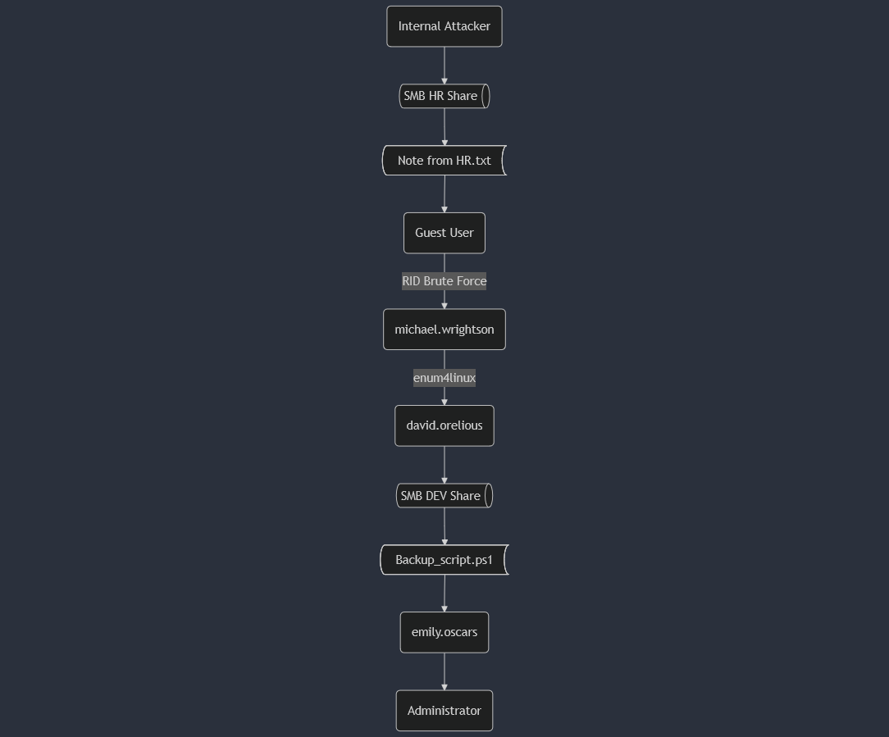
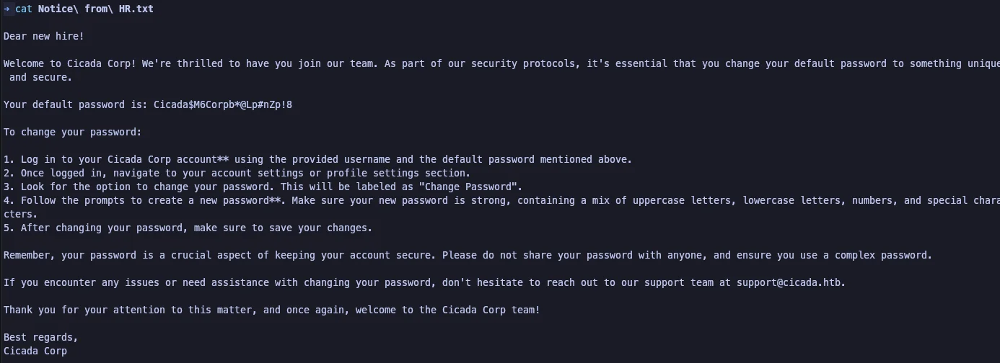
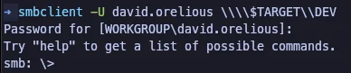
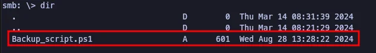
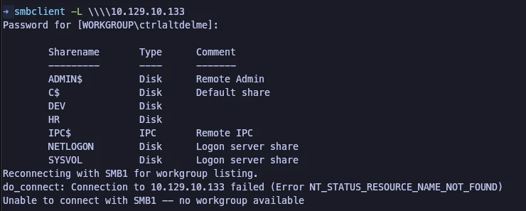
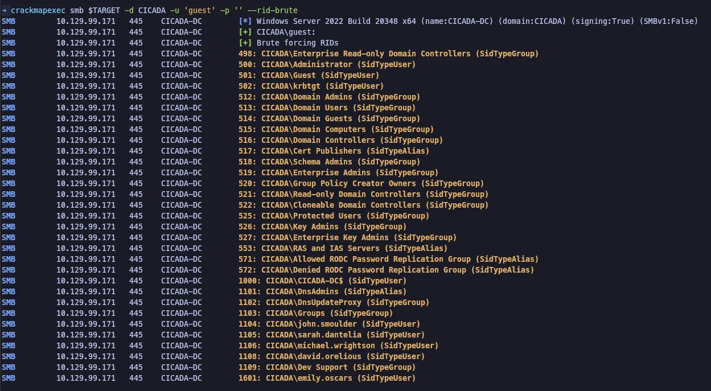
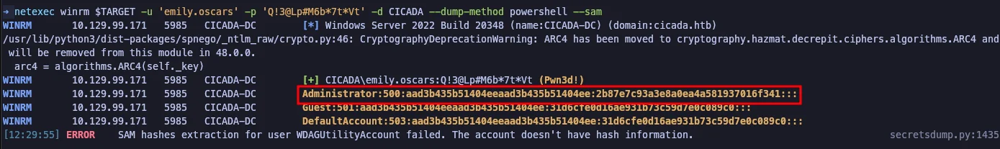
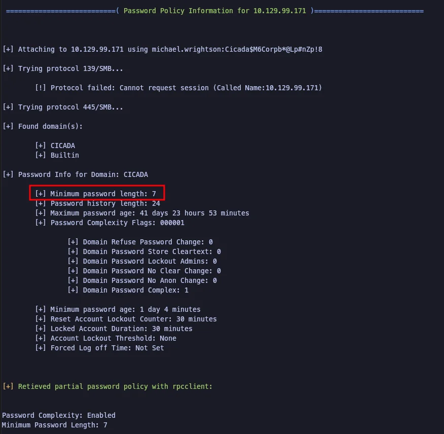
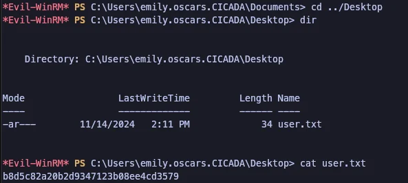
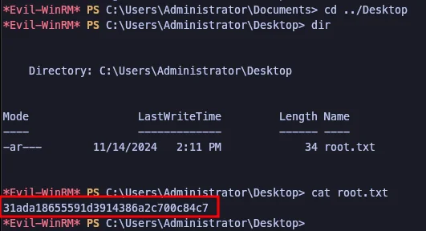

## Table of Contents

## Disclaimer

This is my first attempt at taking a mock penetration test from a CTF like Hack the Box, and writing a full report based on the notes that I took. Being that it's a CTF and not a real life penetration test, the path forward is (generally) obvious and most other attack vectors that seem like they'd be viable end up being rabbit holes. It was also just one machine and not a full network. For the sake of brevity, only the actual attack chain that was used during the pentest is documented. I have some things that I tried to show I didn't get anywhere but I was absolutely not comprehensive. I know that may go against what you'd find in an actual penetration test report, but it's how I decided to do this challenge with the time I have available. This writeup is already two days late from when I posted the [challenge intro](30-days-of-cybersecurity) 🤣.

## Backstory

The fake backstory I'm going with here is that I was hired by Cicada Corp. to test the security of just one server, the domain server. The scenario the company wanted to test was if a bad actor was able to get onto their network, how vulnerable was the domain server?

I was provided the internal IP address and access to the network to simulate a hacker already on the network. With that out of the way, anything beyond this point is the actual report. Starts at [Executive Summary](#executive-summary). Oh, and flags were considered "sensitive information".

Thank you for taking the time to read.

# Executive Summary

0niSec performed a penetration test between the days of 11/13/2024 and 11/14/2024 on the Cicada Corp. Active Directory Domain Server. It concluded on 11/14/2024 with several findings. These findings were all related to misconfiguration, improper access control, or plaintext storage of sensitive information such as passwords and company data.

## Project Overview

0niSec was tasked with testing the security of one (1) server, the domain server, for Cicada Corp. The goal was to determine the security posture of the domain server and identify any vulnerabilities that could be exploited by a bad actor once inside the network.

### Goals

- Identify vulnerabilities that could be exploited by a bad actor
- Determine the security posture of the domain server
- Provide meaningful and actionable remediation suggestions to Cicada Corp.

## Summary of Findings

A total of 5 vulnerabilities were discovered during the testing. No vulnerability was exploited using an outside tool, or known Common Vulnerability and Exposure (CVE). 0niSec concluded that a majority of findings are low severity on their own, but when grouped together and viewed as a whole, led to a critical finding which resulted in obtaining Administrator access on the specified target.

| Vulnerability/Finding                                                                                              | Remediation                                                                            | CWE                                                        |
| ------------------------------------------------------------------------------------------------------------------ | -------------------------------------------------------------------------------------- | ---------------------------------------------------------- |
| [F1.](#f1-plaintext-storage-of-a-password) Plaintext Storage of a Password                                         | Avoid storing passwords in easily accessible locations                                 | [CWE-256](https://cwe.mitre.org/data/definitions/256.html) |
| [F2.](#f2-files-or-directories-accessible-to-external-parties) Files or Directories Accessible to External Parties | Disable all anonymous login capabilities for easily enumerated services (SMB)          | [CWE-552](https://cwe.mitre.org/data/definitions/552.html) |
| [F3.](#f3-improper-privilege-management) Improper Privilege Management                                             | Consider following the principle of separation of privilege.                           | [CWE-269](https://cwe.mitre.org/data/definitions/269.html) |
| [F4.](#f4-weak-password-requirements) Weak Password Requirements                                                   | Enforce a longer minimum password length and stricter password complexity requirements | [CWE-521](https://cwe.mitre.org/data/definitions/521.html) |
| [F5.](#f5-cleartext-storage-in-a-file-or-disk) Cleartext Storage in a File or Disk                                 | Store sensitive information in encrypted format                                        | [CWE-313](https://cwe.mitre.org/data/definitions/313.html) |

## Recommendations

0niSec recommends the following remediation steps to address the identified vulnerabilities:

**Avoid storing passwords in plaintext or easily accessible locations -** Do not store passwords in cleartext in backup files, text files or script files on mission critical infrastructure such as a domain server.

**Disable all anonymous login capabilities for easily enumerated services -** Disable anonymous login on all services, or configure permissions for the anonymous user in such a way that prevents reading files.

**Review configuration and disable/block services that are not critical for operation -** Review the default configuration for the Windows Server and disable any services that are not required for critical operation or not in use.

**Consider following the principle of separation of privilege -** Review access for all users, including the Guest user. If the Guest user is not required, it is recommended it is disabled.

**Enforce a longer minimum password length and stricter password complexity requirements -** The current minimum password length is 7. [CISA](https://www.cisa.gov/secure-our-world/require-strong-passwords) recommends at least a 16 character password. 0niSec agrees with this recommendation.

**Store sensitive information in encrypted format -** Move all sensitive information that could be used by an outside actor for monetary gain or blackmail to a secure server where it is encrypted.

---

# Assessment Report

## Attack Chain

The diagram below details the outline of the attack chain used to compromise the Active Directory Server.



<figcaption>Figure 1 - Attack Chain</figcaption>

## Identified Issues

The below are the findings that were identified during the security assessment performed by 0niSec on the Windows 2022 Active Directory Server.

### F1. Plaintext Storage of a Password

The HR Share could be connected using an anonymous login and a "Notice from HR.txt" file was present that contained the default password for new hires.



<figcaption>Figure 3 - Notice from HR.txt</figcaption>

Further in the attack chain, another cleartext password is obtained using user `david.orelious` and accessing the DEV Share.



<figcaption>Figure 4 - Connecting to DEV Share as david.orelious</figcaption>



<figcaption>Figure 5 - Backup_script.ps1 found in DEV Share</figcaption>

The Powershell file contained a cleartext password for the user `emily.oscars`

```powershell
$sourceDirectory = "C:\smb"
$destinationDirectory = "D:\Backup"

$username = "emily.oscars"
$password = ConvertTo-SecureString "Q!3@Lp#M6b*7t*Vt" -AsPlainText -Force
$credentials = New-Object
System.Management.Automation.PSCredential($username, $password)
$dateStamp = Get-Date -Format "yyyyMMdd_HHmmss"
$backupFileName = "smb_backup_$dateStamp.zip"
$backupFilePath = Join-Path -Path $destinationDirectory -ChildPath
$backupFileName
Compress-Archive -Path $sourceDirectory -DestinationPath $backupFilePath
Write-Host "Backup completed successfully. Backup file saved to:
$backupFilePath"
```

#### Recommendations

To mitigate the risk of cleartext passwords being found or used:

- Do not store cleartext passwords on any computer or server in any file.

### F2. Files or Directories Accessible to External Parties

Using `smbclient`, the attacker is able to enumerate SMB shares on the target.

```bash
smbclient -L \\\\<TARGET_IP>
```



<figcaption>Figure 2 - Listing of shares as anonymous user</figcaption>

#### Recommendations

Disable anonymous access to SMB Shares on a critical resource such as the Active Directory Server or apply stricter privileges to the anonymous account so files cannot be read.

### F3. Improper Privilege Management

Using tool [crackmapexec](https://github.com/byt3bl33d3r/CrackMapExec), the attacker was able to use the default Guest account to brute force Relative Identifiers (RIDs) on the target. This led to the named users on the server:

- john.smoulder
- sarah.dantelia
- michael.wrightson
- david.orelious
- emily.oscars



<figcaption>Figure 6 - Performing RID Brute Force attack as Guest user</figcaption>

Additionally, user `emily.oscars` was allowed to dump the Windows Security Accounts Manager hash for the Administrator using Windows Remote Management on Port 5985 with proper authentication.



<figcaption>Figure 7 - Dumping Administrator hash using netexec</figcaption>

#### Recommendations

To mitigate the risk of improper privileges being misused, abused or exploited:

- Disable the Guest account on a server such as the Active Directory server to mitigate a potential attack sphere
- If WinRM is not essential to the duties of those administering the server, then it should be disabled.
  - If it is essential or makes server management difficult for administrators, then the server should be configured to restrict clients allowed to make remove calls to SAM.

#### Additional Resources

[Microsoft KB to Restrict Clients allowed to make remote calls to SAM](https://learn.microsoft.com/en-us/previous-versions/windows/it-pro/windows-10/security/threat-protection/security-policy-settings/network-access-restrict-clients-allowed-to-make-remote-sam-calls)
[Microsoft KB on Guest Accounts](https://learn.microsoft.com/en-us/previous-versions/windows/it-pro/windows-10/security/threat-protection/security-policy-settings/accounts-guest-account-status)

### F4. Weak Password Requirements

This is an informational finding and was not directly responsible for any exploit or escalation of privileges. However, it was determined that it would improve the security posture of Cicada Corp. It was found that the minimum length for a password for users within the Domain was 7 characters. This should be extended to 16+ and include alphanumeric, numeric, and special characters. It should not contain words found in a dictionary and should not include numbers in sequence (i.e. 123, 789).



<figcaption>Figure 8 - Password Requirements</figcaption>

#### Recommendations

To mitigate the risk of weak passwords being cracked or brute forced by a bad actor:

- Increase the minimum password length to at least 16 characters
- Increase the complexity requirements to require alphanumeric, numeric and special characters
  - Additionally require that no dictionary words be used and numbers should not be allowed to be used in sequence

### F5. Cleartext Storage in a File or Disk

The user `sarah.oscars` and `Administrator` both had business proprietary information on their Desktops.



<figcaption>Figure 9 - Sensitive information on Sarah's Desktop</figcaption>



<figcaption>Figure 10 - Sensitive information on Administrator's Desktop</figcaption>

#### Recommendations

Do not store sensitive information in plaintext on a desktop. This information should be stored in a secure location that is encrypted.
