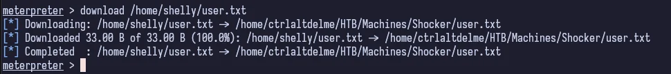
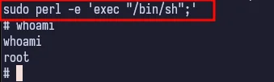

## Table of Contents

## Reconnaisance

Always gotta' start out with `nmap`.


The standard ports are open and we can see that the OS is Linux. SSH seems to be running on a non-standard port of 2222. Weird, but okay.

## Enumeration

We start by navigating to the HTTP webpage being hosted by Apache.


Just a silly little page. Not much to do here, so let's move into enumerating the web directory.


_Without the `-f` flag to append the trailing `/` at the end, the web server treats each request as a file path and returns a 404 instead of another code that `gobuster` is configured to return by default. You can test this by trying to request http://\<ip>/cgi-bin vs. http://\<ip>/cgi-bin/. The former returns a 404 error page and the latter returns a 403._

So now we want to see what files might be hidden in the `cgi-bin` directory. We search common file extensions `sh, pl, php, txt, cgi`. It takes a while because I forgot to set my threads, but we eventually see that there is a `user.sh` script that is not returning a 403. Bingo.


There's a `.sh` script that is being executed. If we just request the file, it prompts us to download it. We can read it out to see what it is.


Since we have a `/cgi-bin` directory and an accessible bash script, we can assume that this is a cgi script and we can try to exploit it. Given the name of the box, we can assume that this is a shellshock exploit.

We can fire up Metasploit and do a quick search for the exploit.


There's a lot of options here, but we're dealing with Apache and cgi, so we're going to pick the `apache_mod_cgi_bash_env_exec` exploit.


Once we confirm our options, we can run the exploit.

## Exploitation


And just like that, we have a meterpreter session. We can immediately check who our user is.


We are `shelly`. Let's see if we can find the user flag.




We find the user flag in `/home/shelly` and download it to our attacking machine using meterpreter.

If we drop into a shell and run `sudo -l`, we see that we can run `perl` as root with no password.


## Privilege Escalation

Escalating privileges with the perl binary is very trivial. We can use [GTFOBins](https://gtfobins.github.io) to find the exploit.

If we search for `perl` in GTFOBins, and scroll down to the [sudo](https://gtfobins.github.io/gtfobins/perl/#sudo) section, we see that we can use the `-e` flag to execute commands.

```bash
sudo perl -e 'exec "/bin/sh";'
```



And now we're root. Getting the final flag is easy.


## Conclusion & Lessons Learned

I went through this box with a co-worker who is also trying to get into cyber security as a sort of "study session". We used the "Guided Mode" to take it easy and learn the process. I was already aware of the machine from discourse on social media and YouTube so I knew that shellshock was the vulnerability to use, but didn't know anything beyond that.

But like every other machine that I've done up to this point, I really enjoyed this one. Doing it collaboratively with someone is also really helpful since we can bounce ideas off of each other and learn from each other. Yay teamwork.
