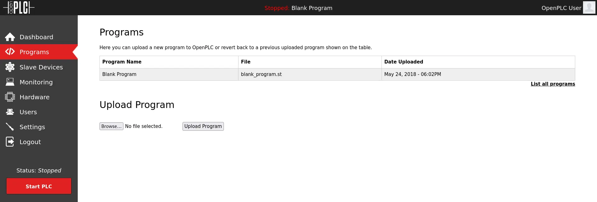

## Table of Contents

## Reconnaisance

Starting out, we scan the network with with `nmap`, using default scripts, version detection and outputting to a file for review in the future if need be.

```bash
nmap -sC -sV -oA ./wifinetictwo 10.129.249.203
```


Not a lot open, SSH and HTTP. But HTTP looks interesting, so let's start with that.

## Enumeration

### Port 80 - HTTP (Werkzeug 1.0.1/OpenPLC)

Once we navigate to the web server on port 8080, we're greeted by a login page. Looking at the page, we can see it's something called OpenPLC. Let's try to login first and then research what OpenPLC is. A quick Google search shows that default OpenPLC credentials are `openplc:openplc`. We test that and get in.

Now one second while I look up what this is.


Okay, so it seems it's a "free and open source alternative to automation". It consists of the editor and the runtime. From reviewing the material available on their website, including a quick overview video, it looks like we're looking at the runtime here.


And the video even goes further to point out that the runtime is responsible for running the programs made in the editor. So let's look at the **Programs** page from the sidebar.



And we see that there's a `blank_program.st` file. I'm not entirely sure what a `.st` file is but given what I just learned, I'm going to assume it's some kind of file that the runtime is capable of executing. If we click on the row in the table, it brings us to the program screen and we have some options. One of which is "Update Program".


### Exploitation & User Flag

We might be able to exploit this using some CVE so I took to Google and quickly found a [POC](https://github.com/thewhiteh4t/cve-2021-31630) for an authenticated (because we're logged in) RCE (remote code execution) (CVE-2021-31630).

Once we run it we get our foothold and a call back to our netcat listener.


## Foothold

Immediately, we already notice that it's strange we are root and the flag is `user.txt`. Given that and the name of the machine, there may be a hint somewhere. So let's try `ifconfig` and `iwconfig`.


So `ifconfig` tells us we do have a `wlan0` and it is in the "UP" status. Interesting. `iwconfig` doesn't tell us too much, but it does tell us that we're not currently associated with any access point. Alright, fine.


Now let's check running processes.


`wpa_supplicant` looks promising but I'm not entirely sure how yet. I can't entirely remember whether this is a common process to be running on HTB machines, but given the name of this one, I was just really tuned into wireless "things". I'll just keep this in my back pocket for the time being. Since the wireless interface is up, we can try to scan for wireless networks using `iw dev wlan0 scan`.

- `iw` - The binary used to show and manipulate wireless devices and their configuration
- `dev` - The command passed to `iw` to tell the program we want to specify a network interface (the next argument)
- `wlan0` - Our wireless interface. This is usually `wlan0`
- `scan` - The final command passed to tell `iw` what we want to do


So this is really interesting. The client we are currently connected to and its wireless interface told us that there's another network out there called `plcrouter`. Alright, that's something to go off of. Not only that, but it looks like it's using WPS-PSK (indicated by the "WPS" key and the "Authentication suites" under "RSN"). Using this, we can try to crack the PSK.

It takes some time researching online how to actually do this. I check out [Hack Tricks](https://book.hacktricks.xyz/generic-methodologies-and-resources/pentesting-wifi#wps-bruteforce) and find the program [OneShot-C](https://github.com/nikita-yfh/OneShot-C). I go through the documentation, compile it and set it off and...


SEGFAULT. Not great. Without really wanting to dig into C code to figure out why it's segfaulting, I Googled around a bit and actually found a Python implementation of this which looked good so I downloaded that and used it instead - [OneShot.py](https://github.com/kimocoder/OneShot).

## Pivoting

I run the script following the documentation on the GitHub and off we go.

```bash
python3 oneshot.py -i wlan0 -K
```


And it worked! So now we know the PSK is `NoWWEDoKnowWhaTisReal123!`. In order to actually connect to the `plcrouter` SSID though, we need to generate a WPA Passphrase using the PSK we just obtained and use `wpa_supplicant` to actually connect. I knew it would come in handy!

```bash
wpa_passphrase plcrouter 'NoWWEDoKnowWhaTisReal123!' > psk
// Output...

wpa_supplicant -c psk -i wlan0
// Output...
```

_I don't know what possessed me to not take screenshots of the output from these commands, but I don't have it and I'm sorry._

Then we have successfully connected to the `plcrouter` wireless network. I noticed that we do not have an IP address assigned so I set one.

```bash
ifconfig wlan0 192.168.1.2 netmask 255.255.255.0
```

I just used a standard Class C RFC1918 IP Address with a /24 (255.255.255.0) subnet and then was able to connect via SSH as root and obtain the flag.


Whew. Done.

## Conclusion & Lessons Learned

This was a really interesting box that I enjoyed working on. It took some time and was definitely a test in enumeration because it isn't your typical enumerate > find CVE > exploit > profit box. While there was a CVE involved, being able to slowly piece together everything and how it all worked was a nice feeling.

- Take better screenshots! I dropped the ball a few times on this one where some better screenshots or even just pastes of terminal output would have been better.
- A Pixie Dust attack is a type of attack aimed at bruteforcing the WPA PSK. It's also called an offline bruteforce attack. The attack focuses on a lack of randomization when generating the two secret [nonces](https://en.wikipedia.org/wiki/Cryptographic_nonce). Knowing the two nonces, the PIN can be recovered.
  - From the definition of a Pixie Dust attack, it seems like only obtaining the PIN is possible, yet `OneShot.py` obtained the PSK too. I'd have to really dive into the code to even begin to try understanding how it does that but for now just starting out, I'll accept it and move on 😆
  - Other tools such as `wifite` and `reaver` could have probably been used here
